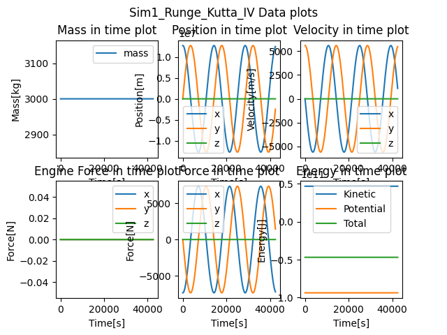

# Engineer_Thesis
The aim of this work was to design, implement in C++ language, prepare documentation and test a library for numerical calculations related to basic spacecraft motion issues. The influence of gravity and vehicle propulsion will be taken into account. The operation was illustrated and tested on examples of typical problems of orbital mechanics, such as transfer between orbits.

# Instructions
- All information can be found in the documentation: 
link 
- Alternatively you can read the: Instructions.md
link

# Simulations
Here are simulation examples that i was able to create and visualize using python with Vpython and matplot lib libraries

## Sim1 
Ship with constant velocity on earth orbit.

## Sim2 
Start of the ship from Earth to the earth orbit.

## Sim3
Hohmann's transfer orbit from lower to higher. 

## Sim4
Moving ship from Earth orbit to Moon orbit

## Sim5
Bi-eliptical transfer from lower to higher orbit.

## Sim6 
Hohmann's transfer orbit from higher to lower. 
